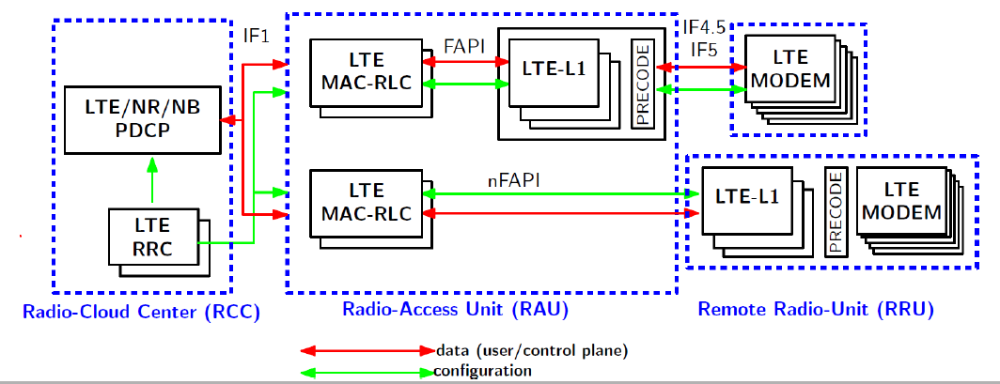

# RELEASE NOTES: #

## [v2.2.0](https://gitlab.eurecom.fr/oai/openairinterface5g/-/tags/v2.2.0) -> November 2024. ##

General 5G improvements (both gNB and UE):
- Make standalone mode (SA) the default (see [`RUNMODEM.md`](doc/RUNMODEM.md))
- Experimental support for FR2 operation
- Support for GEO NTN and simulation of GEO satellite channel in RFsimulator
  (see [`RUNMODEM.md`](doc/RUNMODEM.md))
- Support 2-step RA
- Add optional LTTng logger in logging module (see
  [`lttng_logs.md`](common/utils/LOG/DOC/lttng_logs.md))
- Support for YAML-based config files (alongside libconfig) (see
  [`gnb.sa.band78.106prb.rfsim.yaml`](ci-scripts/conf_files/gnb.sa.band78.106prb.rfsim.yaml) and
  [`nrue.uicc.yaml`](ci-scripts/conf_files/nrue.uicc.yaml))
- Add new L1 scope based on Dear ImGui (see [`readme.md`](openair1/PHY/TOOLS/readme.md))
- Allow cross-compilation on ARM (via SIMDE SIMD emulation library)
- Allow to build and run with clang
- Support/check for Linux capabilities, allow to run without sudo (see
  [`tuning_and_security.md`](doc/tuning_and_security.md))
- OAI does not modify CPU frequency and networking stack
  ([`tuning_and_security.md`](doc/tuning_and_security.md))
- Bugfixes in the entire stack (e.g.  #547, #663, #674, #687, #712, #736, #739,
  #741, #756, #762, #773, ...)

5G gNB:
- Support for FR2 interoperability with COTS UE (no beam switching supported yet)
- Add 4-layer DL MIMO (experimental)
- Add gNB Neighbour configuration and Mobility over F1 interface (see
  [`handover-tutorial.md`](doc/handover-tutorial.md))
- Enhance O-RAN FHI 7.2: (see [`ORAN_FHI7.2_Tutorial.md`](doc/ORAN_FHI7.2_Tutorial.md))
  * Support different bandwidths (40/60/80/100MHz) and antenna configs (1x1 up
    to 4x4) for Benetel/VVDN/LITEON RUs
  * Add support for multi-RU support (single-cell/distributed antenna)
- Support AMD T2 Telco card look-aside L1 accelerator (see
  [`LDPC_T2_OFFLOAD_SETUP.md`](doc/LDPC_T2_OFFLOAD_SETUP.md))
- Support Nvidia Aerial/ARC in-line L1 accelerator (see
  [`Aerial_FAPI_Split_Tutorial.md`](doc/Aerial_FAPI_Split_Tutorial.md))
- Various fixes for multi-UE operation: by default support of up to 16 UEs concurrently
- Documentation for
  - 5G MAC (see [`mac-usage.md`](doc/MAC/mac-usage.md))
  - 5G RRC (see [`rrc-usage.md`](doc/RRC/rrc-usage.md))
  - E1 (see [`E1-design.md`](doc/E1AP/E1-design.md))
  - F1 (see [`F1-design.md`](doc/F1AP/F1-design.md))

5G UE:
- Basic interoperability with COTS gNB (Nokia gNB)
- Implement PHR reporting
- Implement RRC re-establishment
- Implement PUCCH/PUSCH/SRS power control
- Implement UCI on PUSCH and aperiodic CSI reporting
- Support of cell search (within the selected UE bandwidth) (see [`RUNMODEM.md`](doc/RUNMODEM.md))
- Enhance connection control: implement timers, resync
- A lot of internal cleanup

This release also includes many fixes and documentation updates. See
`doc/README.md` in the repository for an overview of documentation.

## [v2.1.0](https://gitlab.eurecom.fr/oai/openairinterface5g/-/tags/v2.1.0) -> February 2024. ##

This release improves existing 5G support and adds various new features.

* 5G gNB
  - Add support for O-RAN 7.2 fronthaul interface
    (tested with 3 O-RUs: Benetel, LITEON, VVDN)
  - Add support for 2-layer UL MIMO
  - FDD interoperability with COTS UE
  - Compiles on ARM (through SIMDE)
  - Introduce E2 agent and basic support for E2SM-KPM and E2SM-RC
  - Add support for E1AP
  - Add support for multiple DUs and CU-UPs at one CU-CP
  - FR2 SA with OAI UE
  - Improve computational efficiency
* 5G UE
  - Cleanup in MAC and RRC towards support of 3rd-party gNB
  - FR2 SA with OAI gNB
  - Improve computational efficiency

Overall the stability is improved for the same resource usage.

There is basic FR2 support between OAI gNB and OAI nrUE. COTS UE
interoperability is under testing.

This release also includes many fixes and documentation updates.

## [v2.0.0](https://gitlab.eurecom.fr/oai/openairinterface5g/-/tags/v2.0.0) -> August 2023. ##

This release adds support for 5G and maintains previous features:
* 5G SA in gNB
  - PHY, MAC, RLC, PDCP, SDAP, RRC layers
  - 2x2 MIMO and 256-QAM for UL/DL
  - 15 and 30 kHz subcarrier spacings; 10-100 MHz bandwidths
  - Up to 800Mbps throughput or 5ms latency
  - F1, basic E1, 5G FAPI (SCF 222.10.02), split 8 split options
  - Handling of up to 16 UEs
  - RRC procedures for connection setup, multiple PDU sessions, reestablishment
* 5G SA in UE
  - PHY, MAC, RLC, PDCP, SDAP, RRC layers
  - 2x2 MIMO and 256-QAM for UL/DL
  - 15 and 30 kHz subcarrier spacings; 10-100 MHz bandwidths
  - Custom FAPI-like MAC/PHY interface
  - RRC procedures for connection setup and cell measurement
* Basic 5G NSA in gNB
  - X2 sgNB Addition Request between OAI eNB and gNB
* 4G eNB and UE
  - Bugfixes in fairRR scheduler (eNB)
  - Non-standard F1 midhaul removed (eNB)
  - FlexRAN removed (eNB)
  - Sync fixes (UE)
* LTE-M supported
* Support for AW2S devices, RFsimulator channel emulation support

For more information on supported features, please refer to the [feature set](doc/FEATURE_SET.md).

## [v1.2.1](https://gitlab.eurecom.fr/oai/openairinterface5g/-/tags/v1.2.1) -> February 2020. ##

* Bug fix for mutex lock for wake-up signal

## [v1.2.0](https://gitlab.eurecom.fr/oai/openairinterface5g/-/tags/v1.2.0) -> January 2020. ##

This version adds the following implemented features:

* LTE-M : eNB support for Mode A repetitions
  - PUSCH CE - 8 Repetitions
* Improved CDRX implementation for monolithic eNB
* Experimental eMBMS support (now also on eNB side)
* Experimental MCE - Multicast Coordination Entity
* Bug fixes

This version also has an improved code quality:

* Better Test Coverage in Continuous Integration:
  - Initial framework to do long-run testing at R2LAB

## [v1.1.1](https://gitlab.eurecom.fr/oai/openairinterface5g/-/tags/v1.1.1) -> November 2019. ##

- Bug fix in the TDD Fair Round-Robin scheduler

## [v1.1.0](https://gitlab.eurecom.fr/oai/openairinterface5g/-/tags/v1.1.0) -> July 2019. ##

This version adds the following implemented features:

* Experimental support of LTE-M
  - Single LTE-M UE attachment, legacy-LTE UE attachment is disabled
* X2 interface and handover (also X2-U interface)
  - In FDD and TDD
* CU/DU split (F1 interface)
  - Tested only in FDD
* CDRX
  - Tested only in FDD
* Experimental eMBMS support (only on UE side)
* Experimental multi-RRU support
  - Tested only in TDD

This version has an improved code quality:

* Simplification of the Build System
  - A single build includes all full-stack simulators, S1/noS1 modes and one HW platform (such as USRP, BladeRF, ...)
* TUN interface is now used as default for the data plane
  - for UE, eNB-noS1 and UE-noS1
* Code Cleanup
* Better Static Code Analysis:
  - Limited number of errors in cppcheck
  - Important Decrease on high Impact errors in CoverityScan
* Better Test Coverage in Continuous Integration:
  - TM2, CDRX, IF4.5, F1
  - OAI UE is tested in S1 and noS1 modes with USRP board
  - Multi-RRU TDD mode
  - X2 Handover in FDD mode

## [v1.0.3](https://gitlab.eurecom.fr/oai/openairinterface5g/-/tags/v1.0.3) -> June 2019. ##

- Bug fix for LimeSuite v19.04.0 API

## [v1.0.2](https://gitlab.eurecom.fr/oai/openairinterface5g/-/tags/v1.0.2) -> February 2019. ##

- Full OAI support for 3.13.1 UHD

## [v1.0.1](https://gitlab.eurecom.fr/oai/openairinterface5g/-/tags/v1.0.1) -> February 2019. ##

- Bug fix for the UE L1 simulator.

## [v1.0.0](https://gitlab.eurecom.fr/oai/openairinterface5g/-/tags/v1.0.0) -> January 2019. ##

This version first implements the architectural split described in the following picture.

* Only FAPI, nFAPI and IF4.5 interfaces are implemented.
* Repository tree structure prepares future integrations of features such as LTE-M, nbIOT or 5G-NR.
* Preliminary X2 support has been implemented.
* S1-flex has been introduced.
* New tools: config library, telnet server, ...
* A lot of bugfixes and a proper automated Continuous Integration process validates contributions.

Old Releases:

* v0.6.1 -> Mostly bugfixes. This is the last version without NFAPI.
* v0.6 -> RRH functionality, UE greatly improved, better TDD support, a lot of bugs fixed.
  - WARNING: oaisim in PHY abstraction mode does not work, you need to use v0.5.2 for that.
* v0.5.2 -> Last version with old code for oaisim (abstraction mode works)
* v0.5.1 -> Merge of bugfix-137-uplink-fixes. It includes stablity fixes for eNB
* v0.5 -> Merge of enhancement-10-harmony-lts. It includes fixes for Ubuntu 16.04 support
* v0.4 -> Merge of feature-131-new-license. It closes issue#131 and changes the license to OAI Public License V1.0
* v0.3 -> Last stable commit on develop branch before the merge of feature-131-new-license. This is the last commit with GPL License
* v0.2 -> Merge of enhancement-10-harmony to include NGFI RRH + New Interface for RF/BBU
* v0.1 -> Last stable commit on develop branch before enhancement-10-harmony

