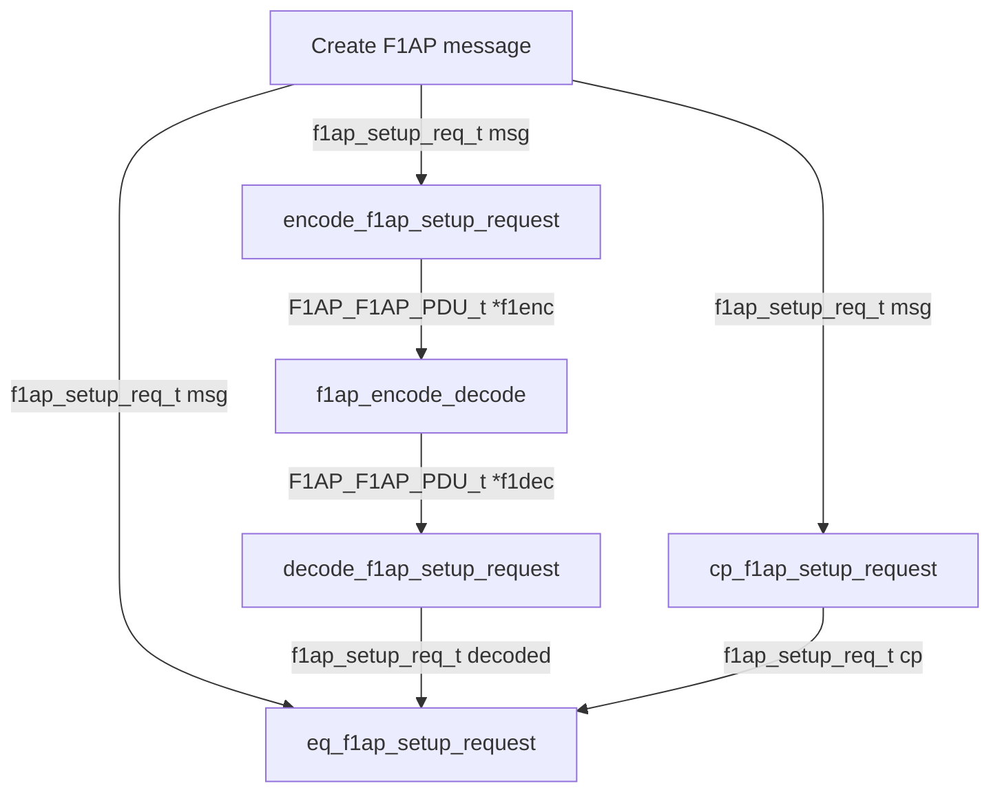

<table style="border-collapse: collapse; border: none;">
  <tr style="border-collapse: collapse; border: none;">
    <td style="border-collapse: collapse; border: none;">
      <a href="http://www.openairinterface.org/">
         
         </img>
      </a>
    </td>
    <td style="border-collapse: collapse; border: none; vertical-align: center;">
      <b>F1AP Messages Encoding & Decoding Library</b>
    </td>
  </tr>
</table>

[[_TOC_]]

# Intro

This library is for the encoding, decoding and testing of F1AP (F1 Application Protocol) messages.

# Implementation Details

The library includes the following components:

1. **Common Functions**:

This file [f1ap_lib_common.c](../../openair2/F1AP/lib/f1ap_lib_common.c) and its corresponding header contain utility functions and macros shared across different F1AP functions.

2. **Message-Specific Modules**:

Each F1AP message (e.g., DL RRC, UL RRC, etc.) has its corresponding modules and each module will include the encoder, decoder, equality check, and memory management functions specific to that message type. Specifically, the goal is to achieve the following:

* **Encoder & Decoder**: Implement encoding and decoding functions for each F1AP message. These functions will convert F1AP messages coming from upper or lower layers into an F1AP PDU to be sent over F1 interface.
* **Equality Check (eq_X)**: `eq_X()` function that compares two messages for equality. This function is useful for testing purposes, ensuring that encoded and decoded messages match.
* **Deep Copy (cp_X)**: `cp_X()` function that performs a deep copy of a message. This function is beneficial when sending ITTI messages, as it avoids manual copying.
* **Memory Management (free_X)**: `free_X()` function to release memory associated with a message. Proper memory management helps prevent memory leaks.

e.g. The following module contains functions that performs the encoding/decoding, equality check, deep copy and memory management for DL/UL RRC message transfer:

* [f1ap_rrc_message_transfer.c](../../openair2/F1AP/lib/f1ap_rrc_message_transfer.c)

# Testing

The functions in the file [f1ap_lib_common.c](../../openair2/F1AP/tests/f1ap_lib_test.c) are used to test F1AP message encoding and decoding functionalities, according to the following steps:

* call the encoder function for the message to be transferred into a F1AP PDU
* use `f1ap_encode_decode` to perform the following steps:
  - Validates the input encoded PDU against constraints.
  - Encodes the PDU using APER into a binary buffer.
  - Decodes the binary buffer back into a PDU.
  - Returns the decoded PDU.
* call the decoder function for the decoded F1AP PDU to obtain the decoded message
* call `eq_dl_rrc_message_transfer` to compare the original message with the decoded one
* call `cp_dl_rrc_message_transfer` to deep copy the original message, then compare the with the original one
* free all messages and PDUs

A flowchart for a function testing F1AP messages, such as `test_f1ap_setup_request`, would look like this:

