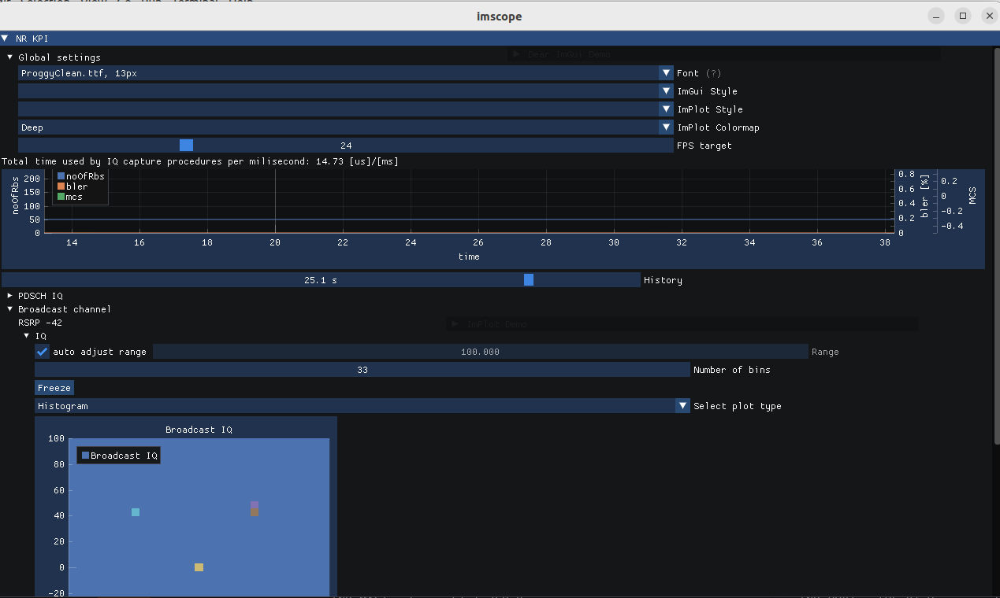

# xForms-based Scope

## How to run and troubleshooting

To compile OAI, build with scope support:
```
./build_oai --build-lib nrscope ...
```

To use the scope, run the xNB or the UE with option `-d`. If you receive the
error
```
In fl_initialize() [flresource.c:995]: 5G-gNB-scope: Can't open display :0
In fl_bgn_form() [forms.c:347]: Missing or failed call of fl_initialize()
```
you can allow root to open X windows:
```
xhost +si:localuser:root
```

### Usage in gdb with Scope enabled

In gdb, when you break, you can refresh immediately the scope view by calling the display function.
The first parameter is the graph context, nevertheless we keep the last value for a dirty call in gdb (so you can use '0')

Example with no variable known
```
phy_scope_nrUE(0, PHY_vars_UE_g[0][0], 0, 0, 0)
```
or
```
phy_scope_gNB(0, phy_vars_gnb, phy_vars_ru, UE_id)
```

# ImScope

ImScope is a scope based on imgui & implot. This scope uses a different concurrency model than xforms scope, with thread
safety being priority. The goal is to never show incorrect data on the screen and be able to use the scope with real radios.
If correctness cannot be achieved e.g. due to performance issues when using thread safe implementation user should be warned
clearly on the screen.



## Prerequisites

ImScope uses imgui, implot, glfw3 and opengl. imgui and implot should be downloaded automatically when configuring the project
with `-DENABLE_IMSCOPE=ON`, using [CPM](https://github.com/cpm-cmake/CPM.cmake). CPM is used because imgui and implot do not have
an official binary release. glfw3 and opengl should be installed with your system, on ubuntu these are contained in packages
libglfw3-dev and libopengl-dev respectivly.

## Building

Add `-DENABLE_IMSCOPE=ON` to your `cmake` command. Build target `imscope`

## Running

Run with `--imscope` flag

## Usage notes

 - It's experimental and might contain bugs
 - It uses tree nodes to hide/show scopes (layout is subject to change). If a scope is not visible or is frozen it costs nearly
 nothing in the PHY threads. If its unfrozen every time the data is displayed the PHY thread would have to perform the copy. By
 default this can happen up to 24 times per second. User is informed on the estimated impact on PHY threads at the top of the
 window. You can use FPS target to limit the impact on PHY threads and maintain scope functionality while minimizing the effect
 on realtime operation.

## Reporting bugs and feature requests

Report bugs and feature requests on [gitlab](https://gitlab.eurecom.fr/oai/openairinterface5g/-/issues). There is two demo windows
enabled in the scope that showcase imgui/implot, if you find something of interest it can be implemented in the scope.
